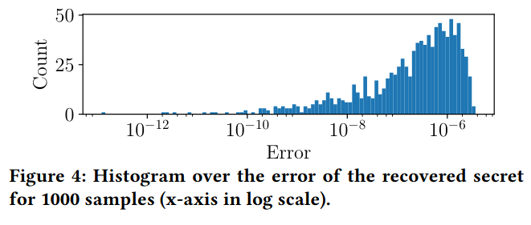

# Section 4 - Controlled channel

[](https://travis-ci.org/github/fritzalder/faulty-point-unit)

We provide the following scripts to reproduce the controlled channel attack: 

 1. Two simple test scripts to verify that the attack works in the enclave: `test.sh` to test the hardware mode and `test_sim.sh` to test the simulation mode.
 2. A script to run the actual controlled channel attack called `binary_search.py`. This script executes 1000 runs of the attack and creates an output called results.csv. On an Intel Core i7-8665U CPU, the script runs at a speed of 5 seconds per iteration which nets to a total runtime of about 90 minutes for a complete run.
 3. A script to evaluate a generated csv file and output a plot. You can control the input file to generate plots from different sources, e.g., `eval.py -f results.csv` or `eval.py -f paper_data.csv` to use the raw data used for the paper Figure 4. The eval script outputs a file named `histogram_error.pdf` that is identical to the file `figure-4.pdf` when called with the original paper data.



## Steps to reproduce Figure 4

To reproduce Figure 4, simply run the scripts in order:

```bash
# Compile and run test
./test.sh
# Run 1000 runs of the attack and place the data in results.csv
# This may take 1-2 hours!
./binary_search.py
# The plot is generated into histogram_error.pdf
./plot.py -f results.csv
```
**Note (runtime).** On an Intel Core i7-8665U CPU, the script runs at a speed of 5 seconds per iteration which nets to a total runtime of about 90 minutes for a complete run. One can control how many tests the `binary_search` script is supposed to run with the `-a` flag which is set to 1000 by default (as this is the reported number in the paper). Example: `./binary_search.py -a 5` to just run 5 tests. We use such a reduced set with 100 runs in the Travis build.

**Note (reproducability).** The binary_search script uses a static seed to make the data reproducible.

**Note (paper data).** To simply verify the plot based on the raw paper data, run `./plot.py -f paper_data.csv`.

To run the controlled channel attack in the simulator, simply run the `./test-sim.sh` script first to compile in simulator mode and then run the attack as normal. It will use the compiled simulator binaries without any further changes to be made.

## Sample output

```bash
$ ./test.s
[Compiling]
[===] Enclave [===]
[RM] inc.o inc.unsigned.so inc.so libinc_proxy.a
[RM] inc_t.o inc_u.o inc_t.h inc_t.c inc_u.h inc_u.c
[RM] main.o main
[===] Enclave [===]
[GEN] sgx_edger8r inc.edl
[CC]  inc_t.c (trusted edge)
[CC]  inc.c (core)
[LD]   inc.o inc_t.o -lsgx_trts inc.unsigned.so
[SGN] inc.unsigned.so
[CC]  inc_u.c (untrusted edge)
[AR]   libinc_proxy.a
[CC]  main.c
[LD] main.o -o main
-fPIC -fno-stack-protector -fno-builtin -fno-jump-tables -fno-common -Wno-attributes -g -D_GNU_SOURCE 
###########################################################################################
# Compiled in HARDWARE mode. You can compile either with SGX_MODE=HW or SGX_MODE=SIM #
###########################################################################################
[Testing a case causing an error]
Usage: ./main HEX_VALUE_OF_SECRET HEX_VALUE_OF_INPUT
Result = 255
[Testing a case causing no exception]
Secret = 6.51000000000000023e-01 (0x3fe4d4fdf3b645a2)
Input = 3.41793219432756385e-308 (0x1893dbd2624ff4)
0: oops = 2.22507385850724437e-308 [in = 3.41793219432756385e-308]
Result = 0
[Testing a case causing an exception]
Secret = 6.51000000000000023e-01 (0x3fe4d4fdf3b645a2)
Input = 3.41793219432749765e-308 (0x1893dbd2624f6e)
Caught float exception w code=7 at adrs abs=0x7f87d037b14f;
           --> FPE_FLTINV
Result = 1
```

```bash
$ ./binary_search.py
Performing 5 tests.
Output file is results.csv

========================================================================

Searching for secret = 0.8444218515250481
|value| < 1, continue...
Recovered = 0.8444245444383957 after 1040 invocations
Error = 2.6929133475350753e-06

========================================================================

Searching for secret = 0.7579544029403025
|value| < 1, continue...
Recovered = 0.7579548773047821 after 1040 invocations
Error = 4.743644795857094e-07

========================================================================

Searching for secret = 0.420571580830845
|value| < 1, continue...
Recovered = 0.4205709885208686 after 1040 invocations
Error = 5.923099763993633e-07

========================================================================

Searching for secret = 0.25891675029296335
|value| < 1, continue...
Recovered = 0.25891660452460086 after 1040 invocations
Error = 1.457683624916939e-07

========================================================================

Searching for secret = 0.5112747213686085
|value| < 1, continue...
Recovered = 0.5112740308195199 after 1040 invocations
Error = 6.905490885777965e-07

[....]
```
